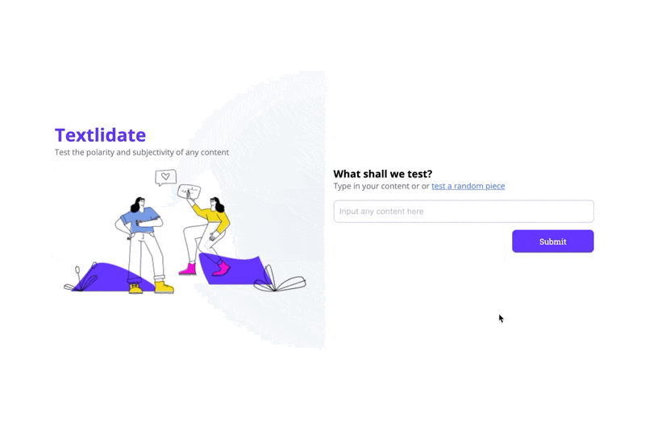

# Travel Journal
A web app that allows you to determine what is the polarity and subjectivity for a inputted piece of string

### Features
- A "random headline" button that allows you to generate random headlines to test with
- Ability to showcase the level of polarity and subjectivity, together with the confidence rate

### Demo

### Created by
Andrew Chen, for Udacity Front End Development Nanodegree, Assignment 3